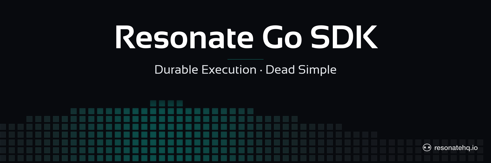

<p align="center">
  <picture>
    <source media="(prefers-color-scheme: dark)" srcset="./assets/banner-dark.png">
    <source media="(prefers-color-scheme: light)" srcset="./assets/banner-light.png">
    
  </picture>
</p>

[](https://github.com/resonatehq/resonate-sdk-go/actions/workflows/ci.yml)
[](https://opensource.org/licenses/Apache-2.0)

# Resonate Go SDK

> ⚠️ **Pre-release.** APIs may change before the first semver-tagged release. Early adopters welcome — pin to a specific commit or use `@main` to track the latest, and check the [open issues](https://github.com/resonatehq/resonate-sdk-go/issues) for known gaps. The internal protocol is stable; the Go API surface is still settling.

## About this component

The Resonate Go SDK lets you build reliable, distributed Go applications on the durable execution programming model. Annotate ordinary Go functions, run them through `Resonate`, and the platform handles retries, recovery, and replay — when a process crashes mid-workflow, execution resumes from the last checkpoint, not from the beginning.

- [Open an issue or pull request](https://github.com/resonatehq/resonate-sdk-go/issues) — contribution starts here while the SDK is prerelease
- [Evaluate Resonate for your next project](https://docs.resonatehq.io/evaluate/)
- [Example application library](https://github.com/resonatehq-examples)
- [Distributed Async Await — the concepts that power Resonate](https://www.distributed-async-await.io/)
- [Join the Discord](https://resonatehq.io/discord)
- [Subscribe to the Journal](https://journal.resonatehq.io)
- [Follow on X](https://x.com/resonatehqio)
- [Follow on LinkedIn](https://linkedin.com/company/resonatehq)
- [Subscribe on YouTube](https://youtube.com/@resonatehq)

## Quickstart

1. Install the Resonate Server & CLI

```shell
brew install resonatehq/tap/resonate
```

2. Install the Resonate Go SDK

```shell
go get github.com/resonatehq/resonate-sdk-go@latest
```

No semver tag is published yet — `@latest` resolves to a Go module pseudo-version pinned to the latest `main` commit. Pin to a specific commit if you need stability before `v0.1.0` is cut.

3. Write your first Resonate function

A durable greeting. The function below runs as a durable workflow: register it, invoke it with a unique ID, and `Resonate` checkpoints every step.

```go
package main

import (
	"context"
	"fmt"
	"log"
	"time"

	resonate "github.com/resonatehq/resonate-sdk-go"
)

type GreetArgs struct {
	Name string `json:"name"`
}

func greet(_ *resonate.Context, args GreetArgs) (string, error) {
	return fmt.Sprintf("hello, %s!", args.Name), nil
}

func main() {
	r, err := resonate.New(resonate.Config{URL: "http://localhost:8001"})
	if err != nil {
		log.Fatalf("resonate.New: %v", err)
	}
	defer func() { _ = r.Stop() }()

	greetFn, err := resonate.Register(r, "greet", greet)
	if err != nil {
		log.Fatalf("Register: %v", err)
	}

	ctx := context.Background()
	id := fmt.Sprintf("greet-%d", time.Now().UnixNano())

	h, err := greetFn.Run(ctx, id, GreetArgs{Name: "world"})
	if err != nil {
		log.Fatalf("Run: %v", err)
	}

	out, err := h.Result(ctx)
	if err != nil {
		log.Fatalf("Result: %v", err)
	}
	fmt.Println(out)
}
```

The full version of this example lives in [`examples/hello`](./examples/hello).

4. Start the server

```shell
resonate dev
```

5. Run the program

```shell
go run .
```

**Result**

You'll see the greeting printed once the workflow settles:

```
hello, world!
```

**What to try**

- Inspect the durable promise the workflow created with `resonate promise get <id>` (the ID is whatever `greet-...` was printed in step 5).
- Visualize the call graph with `resonate tree <id>`.
- Crash the worker mid-run (`Ctrl-C` before `h.Result` returns) and restart it — the same `Run` call will resume rather than re-invoke `greet` from scratch.

## No-server Quickstart

You can also run the SDK entirely in-process with [`localnet`](./localnet) -- no Resonate server installation required. This is ideal for local development, testing, and prototyping.

```go
package main

import (
    "context"
    "fmt"
    "log"
    "time"

    resonate "github.com/resonatehq/resonate-sdk-go"
    "github.com/resonatehq/resonate-sdk-go/localnet"
)

type GreetArgs struct {
    Name string `json:"name"`
}

func greet(_ *resonate.Context, args GreetArgs) (string, error) {
    return fmt.Sprintf("hello, %s!", args.Name), nil
}

func main() {
    pid := "worker-1"
    r, err := resonate.New(resonate.Config{
        Network:   localnet.NewLocal("default", &pid),
        Heartbeat: resonate.NoopHeartbeat{},
    })
    if err != nil {
        log.Fatalf("resonate.New: %v", err)
    }
    defer func() { _ = r.Stop() }()

    greetFn, err := resonate.Register(r, "greet", greet)
    if err != nil {
        log.Fatalf("Register: %v", err)
    }

    ctx := context.Background()
    id := fmt.Sprintf("greet-%d", time.Now().UnixNano())

    h, err := greetFn.Run(ctx, id, GreetArgs{Name: "world"})
    if err != nil {
        log.Fatalf("Run: %v", err)
    }

    out, err := h.Result(ctx)
    if err != nil {
        log.Fatalf("Result: %v", err)
    }
    fmt.Println(out)
}
```

**Key difference:** `localnet` replaces the `URL` field with `Network: localnet.NewLocal("default", &pid)` and **requires** `Heartbeat: resonate.NoopHeartbeat{}`. Without `NoopHeartbeat`, the default `AsyncHeartbeat` spawns goroutines that attempt HTTP requests against a non-existent server endpoint. `localnet` has no HTTP layer -- `NoopHeartbeat` is the correct pairing.

## Replay semantics

Workflow functions execute from the top on every resume. Pure computation can
run directly in the workflow body, but observable side effects such as printing,
sending HTTP requests, or incrementing metrics will happen again on each replay
unless they are wrapped in `ctx.Run`. A settled `ctx.Run` call is recorded as a
durable child promise, so replay short-circuits the child and skips the body.

## What's in the package

The package owns the workflow API (`Context`, `Effects`, `Run`, `RPC`, `Sleep`, `Promise`, `Detached`), the wire protocol (`Sender`, the `Network` interface, push-message decoding), and the shared domain types (`PromiseRecord`, `TaskRecord`, etc.). Concrete transports live in two leaf subpackages:

- [`httpnet`](./httpnet) — HTTP + SSE transport for talking to a live Resonate server.
- [`localnet`](./localnet) — in-process transport that runs the server state machine in a single actor goroutine. Useful for tests and for "no-server-required" local development.

See the package documentation on [pkg.go.dev](https://pkg.go.dev/github.com/resonatehq/resonate-sdk-go) (published once the first semver tag is cut) or read `doc.go` directly.

## Documentation

Read the [docs](https://docs.resonatehq.io) for the full programming model, deployment patterns, and the broader Resonate ecosystem. A Go-specific section will land on the docs site alongside the first tagged release; until then, the `examples/` directory in this repo and the sibling [TypeScript](https://github.com/resonatehq/resonate-sdk-ts), [Python](https://github.com/resonatehq/resonate-sdk-py), and [Rust](https://github.com/resonatehq/resonate-sdk-rs) SDK READMEs are the closest reference.

## License

Apache-2.0 — see [LICENSE](./LICENSE).
